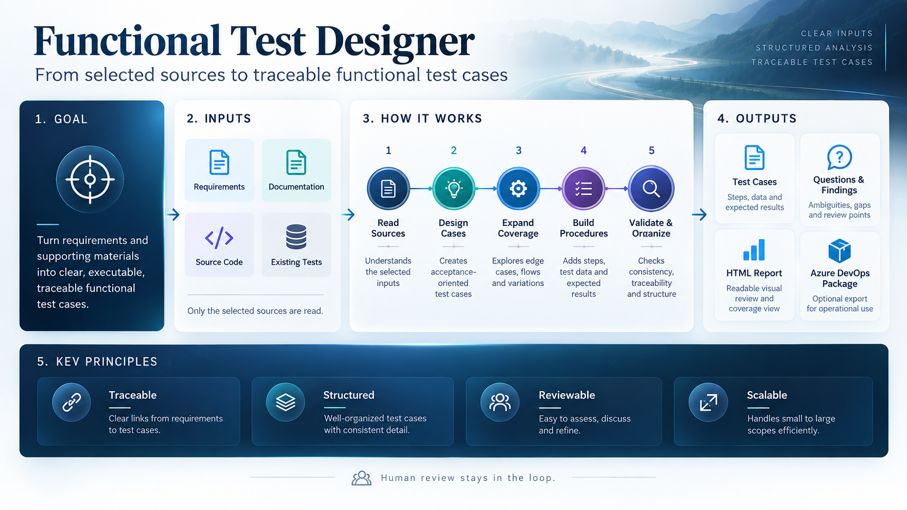

**English** · [Português (Brasil)](README.pt-BR.md)

# Functional Test Designer

  

Agent Skill that designs **traceable, executable functional Test Cases** using only the sources you select — requirements, documentation, source code, and existing tests — across any domain.

- **Input:** an `instructions.md` file describing what to read and what deserves extra attention.
- **Output:** a Test Case suite in JSON (source of truth), Markdown, and an offline HTML report with Questions, Findings, coverage, and traceability.
- **Optional:** a post-suite pass for realistic and adversarial scenarios (`/ftd-chaos`), a local Azure DevOps package (`/ftd-azure`), and, only when explicitly requested, publication to Azure DevOps (`/ftd-azure-publish`).

The model performs the QA reasoning; the runtime protects scope, traceability, validation, and publication. Nothing is silently invented: when the selected sources do not define something safely, the FTD records a Question or an explicit pending item instead.

> Published version: 2.4.1.

## Quick start

1. Copy [`docs/instructions.md`](docs/instructions.md) into your project and edit the sources.
2. Run:

~~~text
/ftd-gen --input-file ./docs/instructions.md --output json,md,html --diagnostics --output-dir ./ftd-output
~~~

3. Open `./ftd-output/output/report.html`.

`--output-dir ./ftd-output` means “store all FTD artifacts under `./ftd-output`” (the default is `<workspace>/ftd-output`). Without `--run-id`, the FTD creates an id such as `ftd-20260925-143000`; run state is stored under `./ftd-output/.ftd/runs/<run-id>/`.

You normally do not need to copy that id. After a successful generation, the FTD remembers the **current validated run** (`./ftd-output/.ftd/current-run.json`), and later commands use it when `--run` is omitted. Only a canonical `VALIDATED` run can become current — never a failed, incomplete, or chaos run — and it is verified again whenever reused. To target an older or specific run, pass `--run <run-id>`.

## The `instructions.md` file

A human-readable configuration file, not a DSL. Headings and wording are free-form; the model interprets the text semantically.

~~~markdown
## Sources
1. `docs/requirements.pdf` — functional authority
2. `docs/user/` — product context
3. `src/` — implementation evidence
4. `tests/` — existing tests

Do not read anything else.

## Things I want you to explore
- wrong actor or resource
- interruption and recovery
~~~

- It is guidance, never authority: an idea that the selected sources do not support does not become a normative Test Case, and guidance never limits the analysis.
- Every guidance item receives an explicit disposition (materialized, already covered, used for ordering, Question, or not applicable with a reason) — it never silently disappears.
- What you say in the conversation or pass on the command line overrides this file.

Post-run actions can also be written in the file using natural language:

~~~markdown
## After the run
- run chaos
- convert to Azure
~~~

The FTD interprets the intent and follows: suite → chaos → refreshed report → **local** Azure package → stop. “Convert/generate/prepare Azure” always means the local package; `/ftd-azure-publish` never runs automatically. On the command line, `--after chaos,azure` or `--after none` overrides the file.

Full commented template: [`docs/instructions.md`](docs/instructions.md).

## Commands

| Command | What it does | Writes outside the machine? |
| --- | --- | --- |
| `/ftd-gen` | Reads the selected sources and generates the canonical suite | No |
| `/ftd-chaos` | Optional post-suite cases for realistic, adversarial, physical, and field scenarios (`CH-*`) | No |
| `/ftd-render` | Re-renders from saved state without rereading sources | No |
| `/ftd-check` | Read-only suite audit | No |
| `/ftd-clarify` | Lists the most important Questions | No |
| `/ftd-azure` | Generates the **local** Azure DevOps package (JSON) | **No — it never connects** |
| `/ftd-azure-publish --prepare` | Reads the Azure DevOps target and creates a local publication plan | No remote writes (read-only remote access) |
| `/ftd-azure-publish --apply` | Publishes the reviewed plan | **Yes — only after explicit approval** |

Natural-language requests also work (“run chaos”, “generate the Azure package”). “Generate/convert/prepare Azure” always means the local package; publication requires an explicit request.

## Full flow

~~~text
/ftd-gen   --input-file ./docs/instructions.md --output json,md,html --output-dir ./ftd-output
/ftd-chaos --input-file ./docs/instructions.md --output json,md,html
/ftd-azure
~~~

For a specific run: `/ftd-azure --run <run-id>` (the same applies to `/ftd-chaos`, `/ftd-check`, `/ftd-render`, and `/ftd-azure-publish --prepare`). If the artifact root is elsewhere, use `--output-dir`.

- `/ftd-chaos` never changes the canonical suite; once finalized, the report, organization, and execution plan are refreshed to include the `CH-*` cases.
- `/ftd-azure` writes `output/azure/azure-export-package.json` and `azure-preview.json`: one work item per case, multiple Suite placements when necessary, never cloned Test Cases.

### Publishing to Azure DevOps (optional and explicit)

~~~text
/ftd-azure-publish --prepare \
    --organization https://dev.azure.com/<your-org> --project <project> --plan <test-plan> --auth azure-cli
~~~

Review the preview first: organization, project, Test Plan, CREATE/UPDATE/CONFLICT counts, and `DELETE operations 0`. Only then:

~~~text
/ftd-azure-publish --apply ./ftd-output/output/azure/publication-plan.json --auth azure-cli
~~~

- `--prepare` first shows which run and canonical digest will be used, then reads the target and creates a `publication-plan.json` bound to that exact state.
- `--apply` rechecks the target and remote revisions, then writes only after you type `PUBLISH <project> / <plan>` (or pass `--approved` in non-interactive mode).
- Every published Test Case carries FTD execution metadata for downstream executors: status, readiness, suitability, automation layer/tool hint, blockers, and Question ids — through a human-readable Description section, `FTD_STATUS:`/`FTD_READINESS:`/`FTD_SUITABILITY:`/`FTD_LAYER:`/`FTD_TOOL:` tags, and a versioned `FTD_METADATA_V1` JSON block. Structured `request_contract` data and related Test Cases are preserved. Full Question details remain in the HTML report, allowing Azure to act as the operational execution source without the original source corpus.
- The destination is never guessed, nothing is deleted, Test Cases not managed by FTD are not overwritten, and credentials are never stored. Details: [`entrypoints/azure-publish.md`](entrypoints/azure-publish.md).

## How it works

~~~text
start       (runtime)  scope → source roles → official identifiers → language → existing tests
reading     (readers)  factual catalogs per source (reused when the source is unchanged)
design      (model)    requirements → atomic claims → Acceptance TCs → frozen normative baseline
expansion   (model)    17 dimensions, operator mistakes, failures, existing tests, E2E journeys (add-only)
procedures  (model)    executable steps, semantic fixtures, pending items, automation metadata
finalize    (runtime)  8 gates → canonical state → HTML / JSON / Markdown → publication proof
~~~

Every model stage is validated by the runtime; an invalid stage is rejected with all detected problems at once. Design, Expansion, and Procedures are semantic reasoning stages — scripts that generate templated payloads are rejected.

- **Scope:** only selected sources; a directory is recursive only within itself.
- **Roles:** `FUNCTIONAL_AUTHORITY` (what must happen), `TECHNICAL_CONTEXT` (how users reach it), `IMPLEMENTATION_EVIDENCE` (what actually exists), and `TEST_ASSET` (existing tests challenge the new suite but are never authority).
- **Language:** the language of the functional authority unless explicitly overridden.

## Outputs

~~~text
./ftd-output/
|-- output/
|   |-- report.html            offline report: requirements, families, E2E, load, physical, chaos, all
|   |-- test-cases.json        index: requirements, coverage, gaps, gates
|   |-- test-cases/TC-XXX.json source of truth for each Test Case
|   |-- test-cases-md/         Markdown version of each Test Case
|   |-- organization.json      groups and execution order (references, no copies)
|   |-- execution-plan.md      each group with its cases in execution order
|   |-- questions.json
|   |-- chaos/<id>/            with /ftd-chaos
|   `-- azure/                 with /ftd-azure (and the /ftd-azure-publish plan)
|-- diagnostics/               with --diagnostics
`-- .ftd/runs/<run-id>/        private run state
~~~

## Security

- FTD reads only the sources you select and never executes their code.
- `/ftd-azure` never connects to anything. Only `/ftd-azure-publish --apply` writes to Azure DevOps, after an explicit target, a reviewed plan, and your approval. There is no delete operation.
- Azure credentials are used only at runtime (Azure CLI session, interactive Microsoft Entra login, or an environment variable you explicitly name) and are never persisted.

## Advanced

- Contracts and references: [`SKILL.md`](SKILL.md), [`references/workflow.md`](references/workflow.md), [`references/stage-contracts.md`](references/stage-contracts.md), [`references/output-contract.md`](references/output-contract.md), [`references/validation.md`](references/validation.md).
- Internal steps (`/ftd-gen` already orchestrates them; use these only for debugging):

~~~bash
python scripts/pipeline.py start --workspace <root> --source "docs/requirements.pdf=FUNCTIONAL_AUTHORITY" \
    --source "src=IMPLEMENTATION_EVIDENCE" --artifact-root <destination> --run-id <id>
python scripts/pipeline.py submit --run <run> --stage design --file design.json      # then expansion, procedures
python scripts/pipeline.py finalize --run <run>
python scripts/pipeline.py verify --run <run>
~~~

- Validate and test:

~~~bash
python -m pip install -r requirements.txt
python scripts/validation.py <destination>/output --manifest <destination>/.ftd/runs/<run-id>/run-manifest.json
python scripts/benchmark.py packs           # six synthetic multi-domain packs
python -m unittest discover -s tests
~~~

## Limits

FTD does not execute tests, create Shared Steps, globally index the repository, or delete/move anything in Azure DevOps during publication.

See also [`CHANGELOG.md`](CHANGELOG.md), the [migration guides](docs/migrations/README.md), and the [history](docs/history/v2.3-simplification-report.md).

## License and Attribution

The MIT license and required copyright notice are preserved in `LICENSE`. Adaptation details remain in `ATTRIBUTION.md`.
