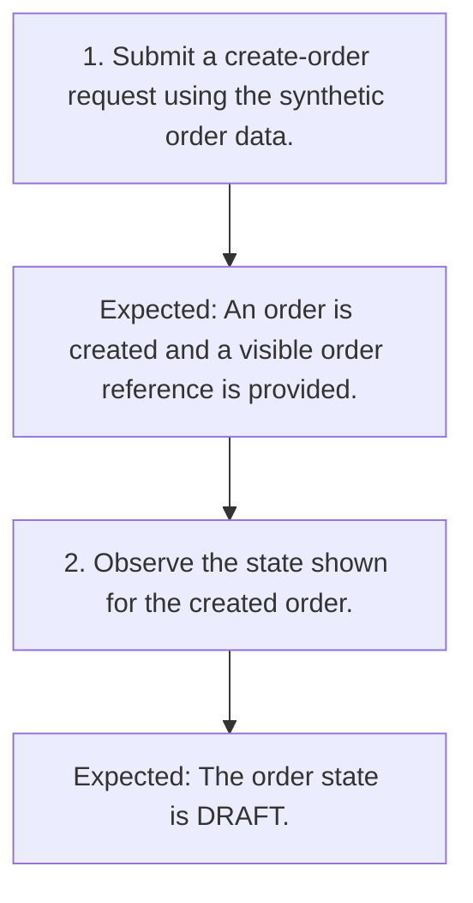

# TC-001 - Create a draft order

**Status:** READY  
**Priority:** HIGH  
**Type:** FUNCTIONAL

## Objective
Confirm that an authorized customer can create an order with a visible reference in DRAFT state.

## Preconditions
- A synthetic customer is signed in with ORDER_EDIT permission.

## Test Data
- **order:** Synthetic order data accepted by the available order entry point.

## Steps
| # | Action | Expected result | Clarification |
|---:|---|---|:---:|
| 1 | Submit a create-order request using the synthetic order data. | An order is created and a visible order reference is provided. | No |
| 2 | Observe the state shown for the created order. | The order state is DRAFT. | No |

## Postconditions
- A synthetic order exists in DRAFT state.

## Cleanup
- Remove the synthetic order using an approved test-environment procedure.

## Traceability
- Requirements: `REQ-001`
- Scenarios: `SCN-001`
- Coverage points: `CP-001`, `CP-002`, `CP-003`
- Sources: `examples/requirements.md` (ORD-001)

## JSON Artifact
`test-cases/TC-001.json`

## Fluxo do Teste

