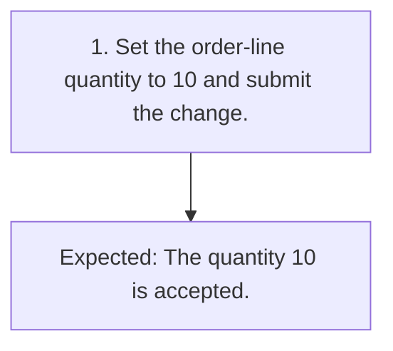

# TC-003 - Accept the maximum quantity

**Status:** READY  
**Priority:** MEDIUM  
**Type:** FUNCTIONAL

## Objective
Confirm that the documented maximum quantity is accepted.

## Preconditions
- A synthetic order exists in DRAFT state with an editable line.

## Test Data
- **quantity:** Maximum valid integer quantity: 10.

## Steps
| # | Action | Expected result | Clarification |
|---:|---|---|:---:|
| 1 | Set the order-line quantity to 10 and submit the change. | The quantity 10 is accepted. | No |

## Postconditions
- The order-line quantity is 10.

## Cleanup
- Restore or remove the synthetic order.

## Traceability
- Requirements: `REQ-002`
- Scenarios: `SCN-003`
- Coverage points: `CP-005`
- Sources: `examples/requirements.md` (ORD-002)

## JSON Artifact
`test-cases/TC-003.json`

## Fluxo do Teste

