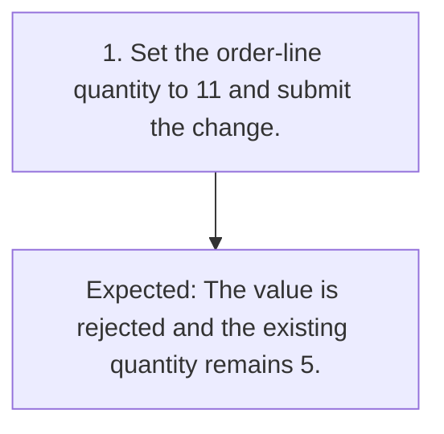

# TC-005 - Reject a quantity above the maximum

**Status:** READY  
**Priority:** MEDIUM  
**Type:** FUNCTIONAL

## Objective
Confirm that a quantity immediately above the permitted range is rejected without changing the existing quantity.

## Preconditions
- A synthetic DRAFT order line has an existing quantity of 5.

## Test Data
- **quantity:** Above-maximum integer quantity: 11.

## Steps
| # | Action | Expected result | Clarification |
|---:|---|---|:---:|
| 1 | Set the order-line quantity to 11 and submit the change. | The value is rejected and the existing quantity remains 5. | No |

## Postconditions
- The order-line quantity remains 5.

## Cleanup
- Remove the synthetic order.

## Traceability
- Requirements: `REQ-002`
- Scenarios: `SCN-005`
- Coverage points: `CP-008`, `CP-009`
- Sources: `examples/requirements.md` (ORD-002)

## JSON Artifact
`test-cases/TC-005.json`

## Fluxo do Teste

