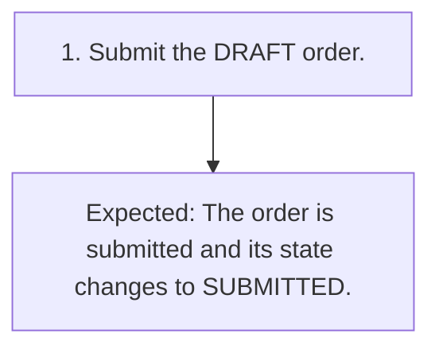

# TC-006 - Submit a draft order

**Status:** READY  
**Priority:** HIGH  
**Type:** FUNCTIONAL

## Objective
Confirm the valid transition from DRAFT to SUBMITTED.

## Preconditions
- A synthetic order exists in DRAFT state.

## Test Data
- **draft order:** A synthetic order currently shown in DRAFT state.

## Steps
| # | Action | Expected result | Clarification |
|---:|---|---|:---:|
| 1 | Submit the DRAFT order. | The order is submitted and its state changes to SUBMITTED. | No |

## Postconditions
- The synthetic order is in SUBMITTED state.

## Cleanup
- Remove the synthetic order using an approved test-environment procedure.

## Traceability
- Requirements: `REQ-003`
- Scenarios: `SCN-006`
- Coverage points: `CP-010`, `CP-011`
- Sources: `examples/requirements.md` (ORD-003), `examples/selected-source/order_service.py` (submit_order)

## JSON Artifact
`test-cases/TC-006.json`

## Fluxo do Teste

