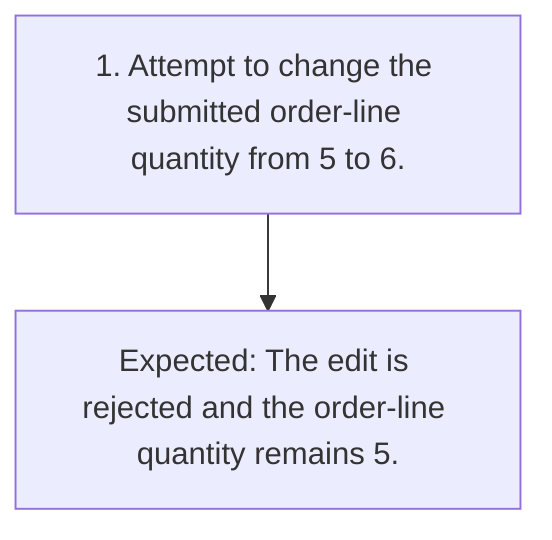

# TC-007 - Reject edits to a submitted order

**Status:** READY  
**Priority:** MEDIUM  
**Type:** FUNCTIONAL

## Objective
Confirm that an edit attempt in SUBMITTED state is rejected without changing order data.

## Preconditions
- A synthetic order exists in SUBMITTED state with a line quantity of 5.

## Test Data
- **attempted edit:** Change the quantity from 5 to 6.

## Steps
| # | Action | Expected result | Clarification |
|---:|---|---|:---:|
| 1 | Attempt to change the submitted order-line quantity from 5 to 6. | The edit is rejected and the order-line quantity remains 5. | No |

## Postconditions
- The order remains unchanged in SUBMITTED state.

## Cleanup
- Remove the synthetic order using an approved test-environment procedure.

## Traceability
- Requirements: `REQ-003`
- Scenarios: `SCN-007`
- Coverage points: `CP-012`, `CP-013`
- Sources: `examples/requirements.md` (ORD-003)

## JSON Artifact
`test-cases/TC-007.json`

## Fluxo do Teste

