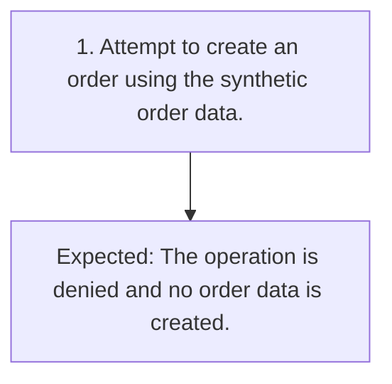

# TC-008 - Deny order creation without permission

**Status:** READY  
**Priority:** CRITICAL  
**Type:** FUNCTIONAL

## Objective
Confirm that order creation is denied without ORDER_EDIT and creates no order data.

## Preconditions
- A synthetic customer is signed in without ORDER_EDIT permission.

## Test Data
- **order:** Synthetic create-order data.

## Steps
| # | Action | Expected result | Clarification |
|---:|---|---|:---:|
| 1 | Attempt to create an order using the synthetic order data. | The operation is denied and no order data is created. | No |

## Postconditions
- No order was created by the denied attempt.

## Cleanup
- None

## Traceability
- Requirements: `REQ-004`
- Scenarios: `SCN-008`
- Coverage points: `CP-014`, `CP-015`
- Sources: `examples/requirements.md` (ORD-004)

## JSON Artifact
`test-cases/TC-008.json`

## Fluxo do Teste

