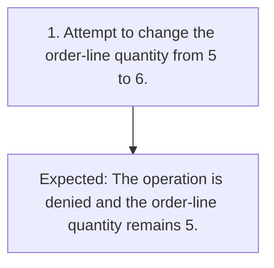

# TC-009 - Deny order editing without permission

**Status:** READY  
**Priority:** CRITICAL  
**Type:** FUNCTIONAL

## Objective
Confirm that order editing is denied without ORDER_EDIT and leaves order data unchanged.

## Preconditions
- A synthetic customer is signed in without ORDER_EDIT permission.
- A synthetic order exists with a line quantity of 5.

## Test Data
- **attempted edit:** Change the quantity from 5 to 6.

## Steps
| # | Action | Expected result | Clarification |
|---:|---|---|:---:|
| 1 | Attempt to change the order-line quantity from 5 to 6. | The operation is denied and the order-line quantity remains 5. | No |

## Postconditions
- The order-line quantity remains 5.

## Cleanup
- Remove the synthetic order.

## Traceability
- Requirements: `REQ-004`
- Scenarios: `SCN-009`
- Coverage points: `CP-016`, `CP-017`
- Sources: `examples/requirements.md` (ORD-004)

## JSON Artifact
`test-cases/TC-009.json`

## Fluxo do Teste

