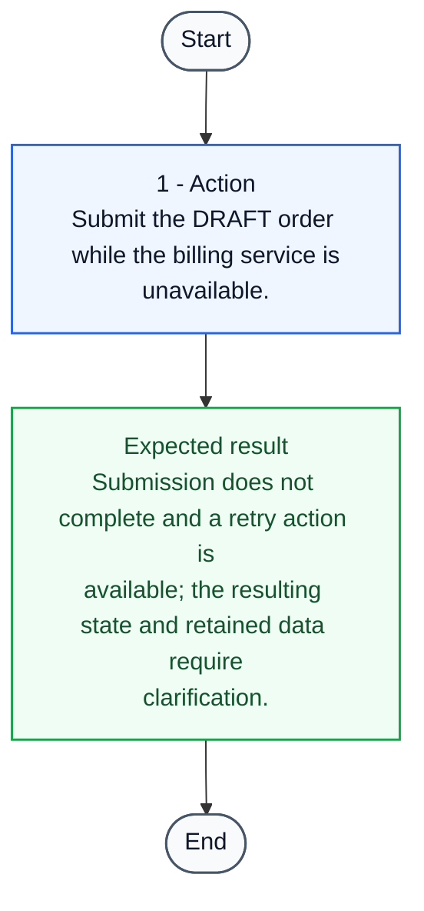

# TC-010 - Handle billing unavailability during submission

**Status:** NEEDS_REVIEW  
**Priority:** HIGH  
**Type:** FUNCTIONAL

## Objective
Confirm the defined failure and retry behavior when billing is unavailable while exposing the undefined post-failure state.

## Preconditions
- A synthetic order exists in DRAFT state.
- The billing service is unavailable through an approved test-environment control.

## Test Data
- **draft order:** A synthetic DRAFT order eligible for submission.

## Steps
| # | Action | Expected result | Clarification |
|---:|---|---|:---:|
| 1 | Submit the DRAFT order while the billing service is unavailable. | Submission does not complete and a retry action is available; the resulting state and retained data require clarification. | Yes |

## Postconditions
- None

## Cleanup
- Restore the billing service test control and remove the synthetic order after recording its observed state.

## Traceability
- Requirements: REQ-006
- Coverage points: CP-019, CP-020
- Sources: `examples/requirements.md` (ORD-006)

## JSON Artifact
`test-cases/TC-010.json`

## Test Flow

