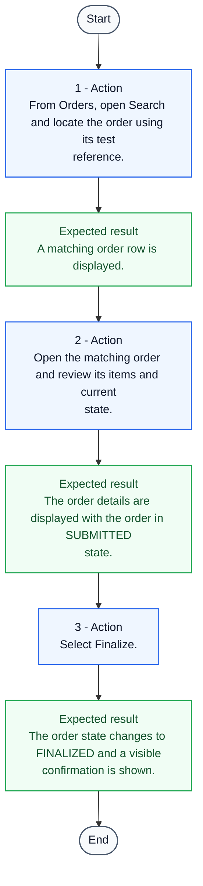

# TC-011 - Finalize a submitted order

**Status:** READY  
**Priority:** HIGH  
**Type:** FUNCTIONAL

## Objective
Confirm that finalization reaches FINALIZED state and provides the required visible confirmation.

## Preconditions
- A synthetic order exists in SUBMITTED state.

## Test Data
- **order reference:** <existing synthetic order reference for an order in SUBMITTED state>

## Steps
| # | Action | Expected result | Clarification |
|---:|---|---|:---:|
| 1 | From Orders, open Search and locate the order using its test reference. | A matching order row is displayed. | No |
| 2 | Open the matching order and review its items and current state. | The order details are displayed with the order in SUBMITTED state. | No |
| 3 | Select Finalize. | The order state changes to FINALIZED and a visible confirmation is shown. | No |

## Postconditions
- The synthetic order is in FINALIZED state.

## Cleanup
- Remove the synthetic order using an approved test-environment procedure.

## Traceability
- Requirements: REQ-008
- Coverage points: CP-023, CP-024
- Sources: `examples/requirements.md` (ORD-008), `examples/selected-source/user-guide.md` (Finalize an order), `examples/selected-source/order_service.py` (finalize_order)

## JSON Artifact
`test-cases/TC-011.json`

## Test Flow

