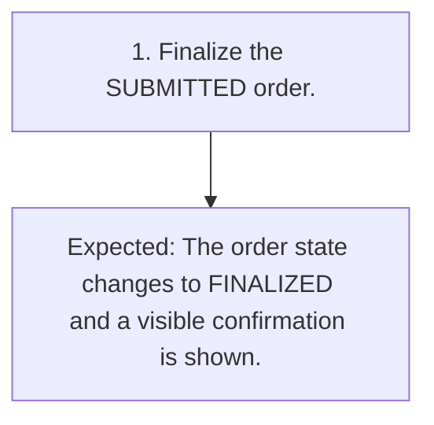

# TC-011 - Finalize a submitted order

**Status:** READY  
**Priority:** HIGH  
**Type:** FUNCTIONAL

## Objective
Confirm that finalization reaches FINALIZED state and provides the required visible confirmation.

## Preconditions
- A synthetic order exists in SUBMITTED state.

## Test Data
- **submitted order:** A synthetic order currently shown in SUBMITTED state.

## Steps
| # | Action | Expected result | Clarification |
|---:|---|---|:---:|
| 1 | Finalize the SUBMITTED order. | The order state changes to FINALIZED and a visible confirmation is shown. | No |

## Postconditions
- The synthetic order is in FINALIZED state.

## Cleanup
- Remove the synthetic order using an approved test-environment procedure.

## Traceability
- Requirements: `REQ-008`
- Scenarios: `SCN-011`
- Coverage points: `CP-023`, `CP-024`
- Sources: `examples/requirements.md` (ORD-008), `examples/selected-source/order_service.py` (finalize_order)

## JSON Artifact
`test-cases/TC-011.json`

## Fluxo do Teste

